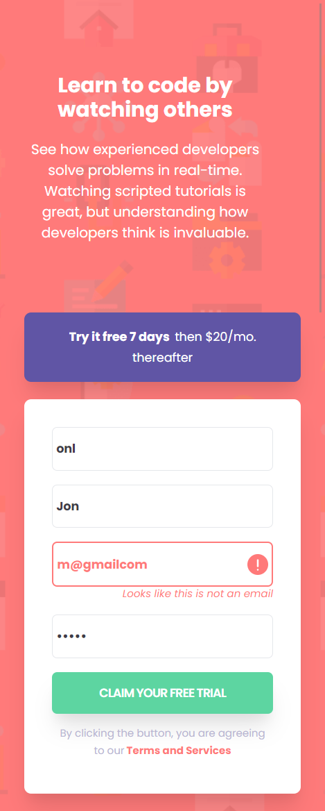

# Frontend Mentor - Intro component with sign up form solution

This is a solution to the [Intro component with sign up form challenge on Frontend Mentor](https://www.frontendmentor.io/challenges/intro-component-with-signup-form-5cf91bd49edda32581d28fd1). Frontend Mentor challenges help you improve your coding skills by building realistic projects. 

## Table of contents

- [Frontend Mentor - Intro component with sign up form solution](#frontend-mentor---intro-component-with-sign-up-form-solution)
  - [Table of contents](#table-of-contents)
  - [Overview](#overview)
    - [The challenge](#the-challenge)
    - [Screenshot](#screenshot)
    - [Links](#links)
  - [My process](#my-process)
    - [Built with](#built-with)
    - [What I learned](#what-i-learned)
  - [Author](#author)

**Note: Delete this note and update the table of contents based on what sections you keep.**

## Overview

### The challenge

Users should be able to:

- View the optimal layout for the site depending on their device's screen size
- See hover states for all interactive elements on the page
- Receive an error message when the `form` is submitted if:
  - Any `input` field is empty. The message for this error should say *"[Field Name] cannot be empty"*
  - The email address is not formatted correctly (i.e. a correct email address should have this structure: `name@host.tld`). The message for this error should say *"Looks like this is not an email"*

### Screenshot

### Links

- Solution URL: [https://www.frontendmentor.io/solutions/intro-sign-up-form-react-tailwind-css-html-2ViqudAnB](https://www.frontendmentor.io/solutions/intro-sign-up-form-react-tailwind-css-html-2ViqudAnB)
- Live Site URL: [[Add live site URL here](https://donmatano.github.io/intro-with-sign-up-form/)](https://donmatano.github.io/intro-with-sign-up-form/)

## My process

### Built with

- Semantic HTML5 markup
- Mobile-first workflow
- [React](https://reactjs.org/) - JS library
- TailwindCss

### What I learned

Using React and hooks.

## Author

- Frontend Mentor - [@DonMatano](https://www.frontendmentor.io/profile/DonMatano)
- Twitter - [@MMatano5](https://www.twitter.com/MMatano5)

